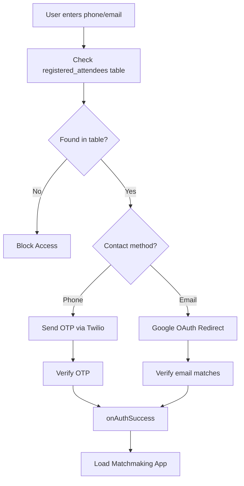

# Mr. Bridge - Professional Networking Matchmaking App

A Next.js-based web application that facilitates professional networking by matching attendees at events based on their profiles and interests.

## Features

- **Authentication**: Dual authentication options
  - Email-based authentication via Google OAuth (Supabase)
  - Phone-based authentication via OTP (Supabase + Twilio)
- **Profile Management**: View professional profiles with skills, experience, and interests
- **Smart Matching**: AI-powered matchmaking using Google Gemini API
- **Excel Integration**: Bulk import attendee data from Excel files
- **Database**: Supabase PostgreSQL backend with Row Level Security

---

## Prerequisites

Before running this project, ensure you have:

- **Node.js**: v18 or higher
- **npm**: v9 or higher
- **Git**: For version control
- **Supabase Account**: Free tier available at [supabase.com](https://supabase.com)
- **Google API Key**: For OAuth and Gemini API access
- **Twilio Account** (optional): For SMS-based OTP authentication

---

## Installation

### 1. Clone the Repository

```bash
git clone https://github.com/LucknowAI/Bridge.git
cd Bridge
```

### 2. Install Dependencies

```bash
npm install
```

### 3. Environment Setup

Copy the environment template and fill in your values:

```bash
cp .env.example .env.local
```

Edit `.env.local` and add your credentials:

```env
# Supabase — Get these from your Supabase project settings > API
NEXT_PUBLIC_SUPABASE_URL=your_supabase_project_url
NEXT_PUBLIC_SUPABASE_ANON_KEY=your_supabase_anon_key

# Service key — NEVER expose to browser, server/scripts only
SUPABASE_SERVICE_KEY=your_supabase_service_role_key

# Gemini API — server-side only
GEMINI_API_KEY=your_gemini_api_key_here
```

#### Getting Supabase Credentials:
1. Create a project at [supabase.com](https://supabase.com)
2. Go to **Settings > API** in your project dashboard
3. Copy the Project URL and Anon Key
4. Copy the Service Role Key (keep this secret!)

#### Getting Gemini API Key:
1. Go to [Google AI Studio](https://aistudio.google.com/app/apikey)
2. Create a new API key
3. Add it to your `.env.local`

---

## Database Setup

### 1. Create Tables in Supabase

1. Go to your Supabase project dashboard
2. Navigate to **SQL Editor**
3. Create a new query and run the SQL schema from [database/schema.sql](database/schema.sql):

```bash
# Or use the Supabase CLI if installed
supabase db push
```

### 2. Import Attendees Data

Once the database is set up, import attendee data from Excel:

```bash
node database/import-attendees.js
```

This script reads `attendees.xlsx` and bulk-inserts records into the `registered_attendees` table using the service role key.

---

## Running the Project

### Development Mode

```bash
npm run dev
```

The application will be available at `http://localhost:3000`

### Production Build

```bash
npm run build
npm start
```

### Linting

```bash
npm run lint
```

---

## Project Structure

```
Mr. Bridge/
├── app/                          # Next.js app directory
│   ├── layout.jsx               # Root layout component
│   ├── page.jsx                 # Home page
│   ├── login.jsx                # Login page
│   ├── MatchApp.jsx             # Main matchmaking interface
│   ├── api/                     # API routes
│   │   ├── lookup-email/        # Check if email registered
│   │   └── match/               # Matchmaking endpoint
│   └── auth/                    # Authentication pages
│       └── callback/            # OAuth callback handler
├── backend/                      # Backend utilities
│   └── authcallback.jsx         # OAuth callback logic
├── database/                     # Database scripts
│   ├── schema.sql               # SQL schema definition
│   └── import-attendees.js      # Bulk import script
├── public/                       # Static assets
├── .env.example                  # Environment variables template
├── next.config.mjs              # Next.js configuration
├── package.json                 # Dependencies & scripts
└── ReadMe.md                    # This file
```

---

## Authentication Workflow

The following diagram shows how users are authenticated in the system:



---

## API Endpoints

### Check Email Registration
- **Endpoint**: `POST /api/lookup-email`
- **Body**: `{ email: string }`
- **Response**: `{ registered: boolean }`

### Get Matches
- **Endpoint**: `POST /api/match`
- **Body**: `{ userId: uuid, limit?: number }`
- **Response**: `{ matches: Array<Profile> }`

---

## Environment Variables Reference

| Variable | Type | Required | Description |
|----------|------|----------|-------------|
| `NEXT_PUBLIC_SUPABASE_URL` | String | Yes | Your Supabase project URL |
| `NEXT_PUBLIC_SUPABASE_ANON_KEY` | String | Yes | Supabase anonymous key (safe for client) |
| `SUPABASE_SERVICE_KEY` | String | Yes | Supabase service role key (server-only) |
| `GEMINI_API_KEY` | String | Yes | Google Gemini API key (server-only) |

**Security Note**: Variables prefixed with `NEXT_PUBLIC_` are exposed to the browser. Never expose service keys or API keys with this prefix.

---

## Database Schema Overview

### `registered_attendees`
Stores user profile information imported from Excel.

| Column | Type | Notes |
|--------|------|-------|
| `id` | UUID | Primary key |
| `name` | Text | Full name |
| `email` | Text | Unique email |
| `phone` | Text | E.164 format (+919876543210) |
| `about_me` | Text | Profile bio |
| `designation` | Text | Job title |
| `domain` | Text | Professional domain |
| `self_description` | Text | Self introduction |
| `years_of_experience` | Integer | Experience in years |
| `most_impressive_build` | Text | Notable achievement |
| `created_at` | Timestamp | Record creation time |

### `match_sessions`
Tracks matchmaking sessions and connections.

---

## Troubleshooting

### Issue: "Invalid API key" error
- **Solution**: Verify your Gemini API key in `.env.local`
- Check that the key has the necessary permissions

### Issue: "Supabase connection failed"
- **Solution**: Verify URL and anon key are correct
- Check your Supabase project is active
- Ensure Row Level Security policies are properly configured

### Issue: "Module not found" errors
- **Solution**: Run `npm install` again
- Delete `node_modules` and `package-lock.json`, then reinstall
- Verify Node.js version (v18+)

### Issue: Excel import not working
- **Solution**: Ensure `attendees.xlsx` exists in the project root
- Verify column headers match the schema
- Check that `SUPABASE_SERVICE_KEY` is set correctly

### Issue: "Twillo is not working and niether the routes for it is correct and connected"
- It won't since we are using OAuth signin methods/Google signin for logins via registered ids and OTP verification over registered mail for signins via registered phone numbers

---

## Development Tips

- **Hot Reload**: Next.js automatically reloads on file changes during `npm run dev`
- **Database Debugging**: Use Supabase dashboard to inspect tables and policies
- **API Testing**: Use VS Code REST Client or Postman to test API endpoints
- **Environment Variables**: Restart dev server after changing `.env.local`

---

## Contributing

We welcome contributions! Please:

1. Fork the repository
2. Create a feature branch: `git checkout -b feature/your-feature`
3. Commit changes: `git commit -m "Add your feature"`
4. Push to branch: `git push origin feature/your-feature`
5. Submit a Pull Request

---

## License

This project is licensed under the MIT License - see the [LICENSE](LICENSE) file for details.

---

## Support & Contact

For questions or issues:
- Open an issue on [GitHub](https://github.com/LucknowAI/Bridge/issues)
- Check existing documentation in the repository
- Contact the development team

---

**Last Updated**: May 2026  
**Repository**: [LucknowAI/Bridge](https://github.com/LucknowAI/Bridge)
